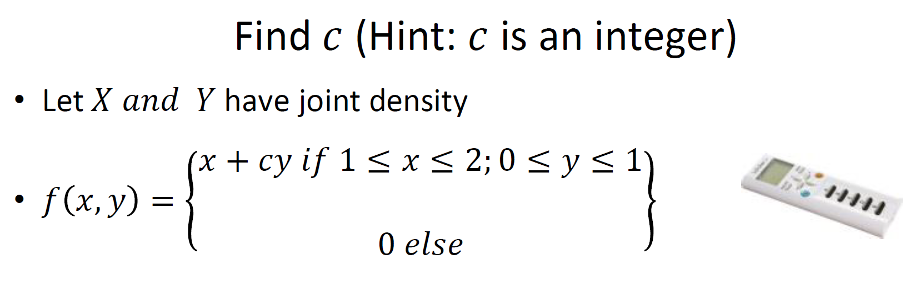
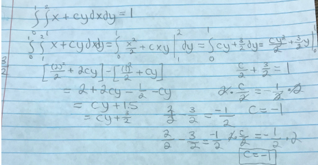

```{r setup, include=FALSE}
knitr::opts_chunk$set(echo = TRUE)
```

# Introduction

You will need to solve the following clicker problem by the performing the steps below:

{ width=60% }

# Steps

## Step 1

What bivariate property will you use to solve this problem? I will be using the Bivariate for Continuous Random Variable to solve this problem. For the bivariate density function I will be using property number three with integrations to solve this problem specificly.

$\LaTeX$

## Step 2

What region will you integrate over? I will integrate over x-axis from 1 to 2 and y-axis from 0 to 1.

Draw the plot -- change the value of a and b to get the correct area (no programming needed)

```{r }
plot(0:4,seq(0,2,length=5), type="n",xlab="x",ylab="y")
a=1
b=2
segments(x0=c(a,a,b),y0=c(0,1,1),x1=c(a,b,b),y1=c(1,1,0), col="Red")
polygon(c(a,a,b,b), c(0,1,1,0), col="yellow")
```

# Step 3

Find `c` by showing all working -- no need for $\LaTeX$ (though you can if you wish) -- 

You can do this on a piece of paper and then use 

Work for me solving c is below:
```{r}

```

