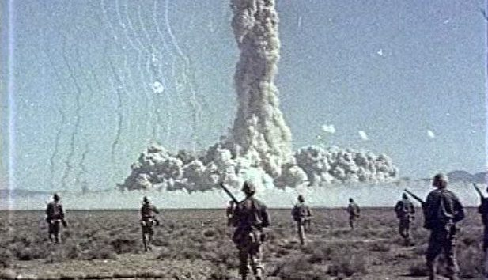

```{r setup, include=FALSE}
knitr::opts_chunk$set(echo = TRUE)
```

<center>
{ width=20% }
</center>


# Introduction
Nuclear weapons were developed during WWII. The United States was developing this weapon under the secretive program, the Manhatten Project. Germany was also trying to develop this weapon too. To this day, the United States is the only nation on Earth to ever use such a weapon on another nation. According to the Department of Energy, the United States conducted 1,054 nuclear tests with most being in Nevada test site. Back then, the dangers of exposures was not widely understood as it is today. Here we are analyzing the connections between thyroid cancer and atomic weapons exposure.

Below is Operation Desert Rock conducted between 1951 and 1957 (Image from the Atomic Heritage Foundation). The purpose was to train troops on battlefield maneuvering during and after a nuclear explosion:

<center>
{ width=40% }
</center>

## The Data
According to the problem, out of 23,000 people exposed, 58 people will develop thyroid cancer in their lifetime.
```{r atomic_data}
atomic_data = read.csv("data/ATOMIC.csv")
atomic_data
```

## What are the variables? 
The variables are doses, gender, and number of thyroid cases.

### Plot data and Interpretation
```{r atomic_plot}
library(ggplot2)
g = ggplot(atomic_data, aes(x = DOSE, y = NUMBER)) + geom_point(aes(color = GENDER)) + ggtitle("Atomic Weapons Exposure")
g

library(s20x)
pairs20x(atomic_data)
```

From the plots, the male and female data seem to follow each other and there are more females affected with thyroid cancer than men.

## How were the data collected?
It was collected through estimations with an algorithm at Oak Ridge Laboratory.

## What is the story behind the data?
According to the book, researchers at the Oak Ridge Laboratory in Tennessee have developed an algorithm to estimate the numbers of expected and excess cases of thyroid cancer occurring in the lifetime of those exposed to atomic weapons test at the Nevada Test Site in the 1950s.

## Why was it gathered?
It was gathered to see if gender and doses at the time of exposure are independent.

## What is your interest in the data?
I am interested in seeing how workers and soldiers working at these test sites are doing compared with other people in their generation health-wise.

## What problem do you wish to solve?
I wish to solve the problem of compensation for those affected by the actions of the government to expose the troops and other workers to these harmful weapons. I have used statistics to analyze the data that these weapons are causing a rise in chances of a person developing thyroid cancer.

# Theory needed to carry out SLR
Linear expression is expressed as:
$$
Y = \beta_0 + \beta_1X + \epsilon_i
$$
Those beta values are coefficients needed to make predictions. $\beta_0$ and $\beta_1$ are unknown parameters. Y is equal to the mean value given X and $\epsilon$ is the random error.

According to the book, SLR is a probabilistic model and would be useful to seeing if doses would lead to a rise in thyroid cancer when exposed to atomic radiation. With a certain deviation: $E(\epsilon)=0$. The expected value of $E(y)$ is:

$$
E(y) = E(\beta_0 + \beta_1X + \epsilon_i) \\
E(y) = \beta_0 + \beta_1X + E(\epsilon_i) \\
E(y) = \beta_0 + \beta_1X
$$

According to the book, we have to make these assumptions about $\epsilon$:

1) The mean of the probability distribution of $\epsilon = 0$.

2) $\epsilon$ is normally distributed.

3) Errors from one observation are independent from others.

4) The variance of the probability distribution of $\epsilon$ is constant for all values of the independent variable - for a straight line model this means V($\epsilon$) = a constant for all values of x.

## Method of Least Squares

This is one part needed to carry out SLR: Least Squares Method.
```{r atomic_least_squares}
atomic.lm = lm(NUMBER~DOSE, data = atomic_data)
summary(atomic.lm)
```

So the following values were found:
$$
\hat{\beta_0} = 9.500 \\
\hat{\beta_1} = 3.500 \\
\hat{\beta_2} = -3.000 \\
$$

What would use these values later to determine the best models for the atomic data.

## Calculating Confidence Interval for Parameter Estimates
```{r atomic_ci}
ciReg(atomic.lm, conf.level=0.95, print.out=TRUE)
```

## Least Squares Estimates
$$
\hat{\beta_0}+\hat{\beta_1}X+\hat{\beta_2}X^2=9.5+3.5X-3.0X^2 \\
$$

I believe this is suggesting that $\beta_1$ increases while $\beta_2$ decreases is telling us that there is more cases of thyroid cancer around doses 1-10 than higher doses. Lets not make any assumptions here as there maybe many unknown factors at play.

# Validity with mathematical expressions
Here we use the numbers calculated to see if the straight-line would be the best fit for the atomic data.

```{r atomic_assumptions}
plot(NUMBER~DOSE,bg="Blue",pch=21,cex=1.2,
     ylim=c(0,20),xlim=c(0,5),
     main="Scatter Plot and Fitted Line of Number vs Dose", data=atomic_data)
abline(atomic.lm)
```

So there is a plot going on telling us about the data. Lets run some more tests.

$$\epsilon_i \sim N(0,\sigma^2)$$

### Shapiro-wilk
```{r shapiro_wilk_normality}
normcheck(atomic.lm, shapiro.wilk = TRUE)
```

After using shapiro-wilk normality test, the p-value for the atomic data is 0.089. Since the p-value of 0.089 is greater than 0.05, that means the data is distributed normally and we would not reject the null hypothesis.

### Constant variance
This is when plotting an error against predicted value, variance of the predicted value should be constant.

### Residual vs fitted values
```{r residual_fitted}
plot(NUMBER~DOSE,bg="Blue",pch=21,cex=1.2,
              ylim=c(0,20),xlim=c(0,5),
              main="Residual Line Segments of Number vs Dose", data=atomic_data)
ht.lm=with(atomic_data, lm(NUMBER~DOSE))
abline(ht.lm)
yhat=with(atomic_data,predict(ht.lm,data.frame(DOSE)))
abline(ht.lm)
```

### trendscatter on Residual Vs Fitted
```{r trendscatter_residual_fitted}
# Linear object.
atomic.lm = with(atomic_data, lm(NUMBER~DOSE))

# Residuals.
height.res = residuals(atomic.lm)

# Fitted value.
height.fit = fitted(atomic.lm)

trendscatter(height.res~height.fit, f = 0.5, data = atomic.lm, xlab="Fitted Values",ylab="Residuals",ylim=c(-1.1*max(height.res),1.1*max(height.res)),xlim=c(0,1.1*max(height.fit)), main="Residuals vs Fitted Values")
```

There is some uniform to this plot so linear model would best represent atomic data and thyroid cancers.

## Use adjusted $R^2$ 
$$R_{adj}^2 = 1 - [\frac{(1-R^2)(n - 1)}{n - k - 1}]$$

The closer $R^2$ is to 1 the better fit of the trend line. $R^2=\frac{MSS}{TSS}$
```{r atomic_r2}
RSS = with(atomic_data, sum((NUMBER-yhat)^2))
RSS

MSS = with(atomic_data, sum((yhat-mean(NUMBER))^2))
MSS

TSS = with(atomic_data, sum((NUMBER-mean(NUMBER))^2))
TSS

R2 = MSS/TSS
R2
```

R2 is about 0.29 and that means if not a very significant correct fit for the dataset.

### Use of `predict()`
Lets try to predict the doses with the following number of cases of thyroid cancers 20, 25, 41, 55, 59, 68.
```{r atomic_predict}
model1 = predict(atomic.lm, data.frame(NUMBER=c(20,25,41,55,59,68)))
model1
```

### Use of `ciReg()`
```{r ciReg2}
ciReg(atomic.lm, conf.level=0.95, print.out=TRUE)
```

### Check on outliers using cooks plots
We can use cooks plots to check for outliers and how they may be distorting the regression plot.
```{r cooks_plot}
cooks20x(atomic.lm)
```

2 and 5 are pretty high up there compared with the others.

# Conclusion
According to the data, just looking at the doses and number of people developing thyroid cancer, there isn't a significant relationship between doses and cancer. People that had doses of 1-10 had higher numbers than those exposed to <11. 58 cases out of 23,000 people exposed, 58/23000 is 0.0025. Less than 1% of cases out of 23,000 people. That maybe because civilian workers, whom help developed the bomb, makes up the majority of the 23,000. Troops that walked into the test site after the blast makes up a smaller percentage. Linear model isn't that great in this case.
There is still a risk associated with exposure. The good news is many nations have signed the Comprehensive Nuclear-Test-Ban Treaty. The most recent testing of nuclear weapons was from North Korea. North Korea has offered to stop testing as long as South Korea and the US stop their joint exercises of a North Korea invasion. Likely these weapons won't be used again.

## Answer your research question
Repeat of my research question: Is there a relationship between the number of thyroid cases and exposure to nuclear radiation? 

After using statistics such as plots, confidence intervals, and more, there is not a significant relationship between cases of thyroid cancer and atomic exposure. Again this is just from the stats as there are many more factors involved such as did they specify troops or civilians workers? I don't want to come to a conclusion on a serious topic without more testing and data.

## Suggest ways to improve model or experiment
This is the current model but there is room for improvement. I think there needs to be more data in order to test for better numbers and come to a better solution.

# References
U.S. Department of Energy Nevada Operations Office.2000."United States Nuclear Test July 1945 through September 1992."https://web.archive.org/web/20061012160826/http://www.nv.doe.gov/library/publications/historical/DOENV_209_REV15.pdf

Wikipedia. n.d.Comprehensive Nuclear-Test-Ban Treaty.https://en.wikipedia.org/wiki/Comprehensive_Nuclear-Test-Ban_Treaty
