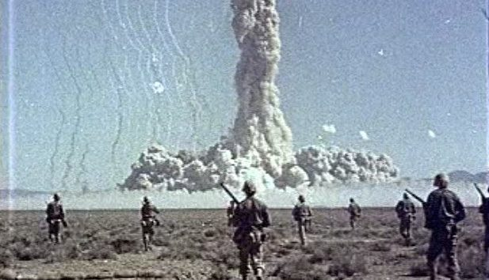

```{r setup, include=FALSE}
knitr::opts_chunk$set(echo = FALSE)
```

## Introduction

Atomic Weapons exposure

During the 1940s and 1950s, the United States conducted 1,054 nuclear tests mostly in Nevada test site.

Below is Operation Desert Rock conducted between 1951 and 1957 (Image from the Atomic Heritage Foundation).

<center>
{ width=40% }
</center>

## Problem

Because of the radiation, it has led researchers to look into the effects of these testings on workers exposed to these atomic weapons. It would be looking at doses and number of thyroid cancer cases.

```{r atomic_data}
atomic_data = read.csv("data/ATOMIC.csv")
atomic_data
```

## Plot data and interpretation

```{r atomic_plot}
library(ggplot2)
g = ggplot(atomic_data, aes(x = DOSE, y = NUMBER)) + geom_point(aes(color = GENDER)) + ggtitle("Atomic Weapons Exposure")
g
```

## Theory needed to carry out SLR:

$$
Y = \beta_0 + \beta_1X + \epsilon_i
$$
Where $\beta_0$ and $\beta_1$ are unknown parameters. $\epsilon_i$ is the random error.

## Assumptions
According to the book, we have to make these assumptions about $\epsilon$:

1) The mean of the probability distribution of $\epsilon = 0$.

2) $\epsilon$ is normally distributed.

3) Errors from one observation are independent from others.

4) The variance of the probability distribution of $\epsilon$ is constant for all values of the independent variable - for a straight line model this means V($\epsilon$) = a constant for all values of x.

## Method of Least Squares
```{r atomic_least_squares}
atomic.lm = lm(NUMBER~DOSE, data = atomic_data)
summary(atomic.lm)
```

## Least Square Methods cont.
$$
\hat{\beta_0} = 9.500, \hat{\beta_1} = 3.500, \hat{\beta_2} = -3.000
$$

Least Squares Estimate
$$
\hat{\beta_0}+\hat{\beta_1}X+\hat{\beta_2}X^2=9.5+3.5X-3.0X^2
$$

## Calculating Confidence Interval for Parameter Estimates
```{r atomic_ci}
library(s20x)
ciReg(atomic.lm, conf.level=0.95, print.out=TRUE)
```

## Validity with mathematical expressions
```{r atomic_assumptions}
plot(NUMBER~DOSE,bg="Blue",pch=21,cex=1.2,
     ylim=c(0,20),xlim=c(0,5),
     main="Scatter Plot and Fitted Line of Number vs Dose", data=atomic_data)
abline(atomic.lm)
```

## Shapiro-wilk
```{r shapiro_wilk_normality}
normcheck(atomic.lm, shapiro.wilk = TRUE)
```

## Shapiro-wilk cont.
After using shapiro-wilk normality test, the p-value for the atomic data is 0.089. Since the p-value of 0.089 is greater than 0.05, that means the data is distributed normally and we would not reject the null hypothesis.

## Residual vs fitted values
```{r residual_fitted}
plot(NUMBER~DOSE,bg="Blue",pch=21,cex=1.2,
              ylim=c(0,20),xlim=c(0,5),
              main="Residual Line Segments of Number vs Dose", data=atomic_data)
ht.lm=with(atomic_data, lm(NUMBER~DOSE))
abline(ht.lm)
yhat=with(atomic_data,predict(ht.lm,data.frame(DOSE)))
abline(ht.lm)
```

## trendscatter on Residual Vs Fitted
There is some uniform to this plot so linear model would work.
```{r trendscatter_residual_fitted}
# Linear object.
atomic.lm = with(atomic_data, lm(NUMBER~DOSE))

# Residuals.
height.res = residuals(atomic.lm)

# Fitted value.
height.fit = fitted(atomic.lm)

trendscatter(height.res~height.fit, f = 0.5, data = atomic.lm, xlab="Fitted Values",ylab="Residuals",ylim=c(-1.1*max(height.res),1.1*max(height.res)),xlim=c(0,1.1*max(height.fit)), main="Residuals vs Fitted Values")
```

## Use adjusted $R^2$ 
$$R_{adj}^2 = 1 - [\frac{(1-R^2)(n - 1)}{n - k - 1}]$$

The closer $R^2$ is to 1 the better fit of the trend line. $R^2=\frac{MSS}{TSS}$
```{r atomic_r2}
RSS = with(atomic_data, sum((NUMBER-yhat)^2))
RSS

MSS = with(atomic_data, sum((yhat-mean(NUMBER))^2))
MSS

TSS = with(atomic_data, sum((NUMBER-mean(NUMBER))^2))
TSS

R2 = MSS/TSS
R2
```

R2 is about 0.29 and that means if not a very significant correct fit for the dataset.

## Use of `predict()`
Lets try to predict the doses with the following number of cases of thyroid cancers 20, 25, 41, 55, 59, 68.
```{r atomic_predict}
model1 = predict(atomic.lm, data.frame(NUMBER=c(20,25,41,55,59,68)))
model1
```

## Use of `ciReg()`
```{r ciReg2}
ciReg(atomic.lm, conf.level=0.95, print.out=TRUE)
```

## Check on outliers using cooks plots
Using cooks plots to check for outliers and how they may be distorting plot.
```{r cooks_plot}
cooks20x(atomic.lm)
```

## Conclusion
There isn't a significant relationship between number of thyroid cases and doses of exposure.
Linear model isn't great for this type of problem.

## References
U.S. Department of Energy Nevada Operations Office.2000."United States Nuclear Test July 1945 through September 1992."https://web.archive.org/web/20061012160826/http://www.nv.doe.gov/library/publications/historical/DOENV_209_REV15.pdf

Wikipedia. n.d.Comprehensive Nuclear-Test-Ban Treaty.https://en.wikipedia.org/wiki/Comprehensive_Nuclear-Test-Ban_Treaty
